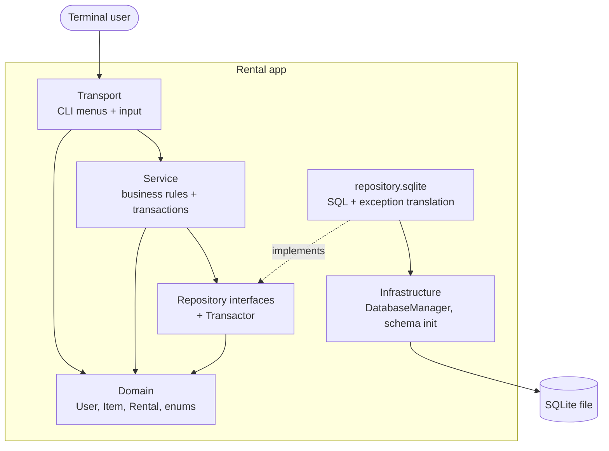
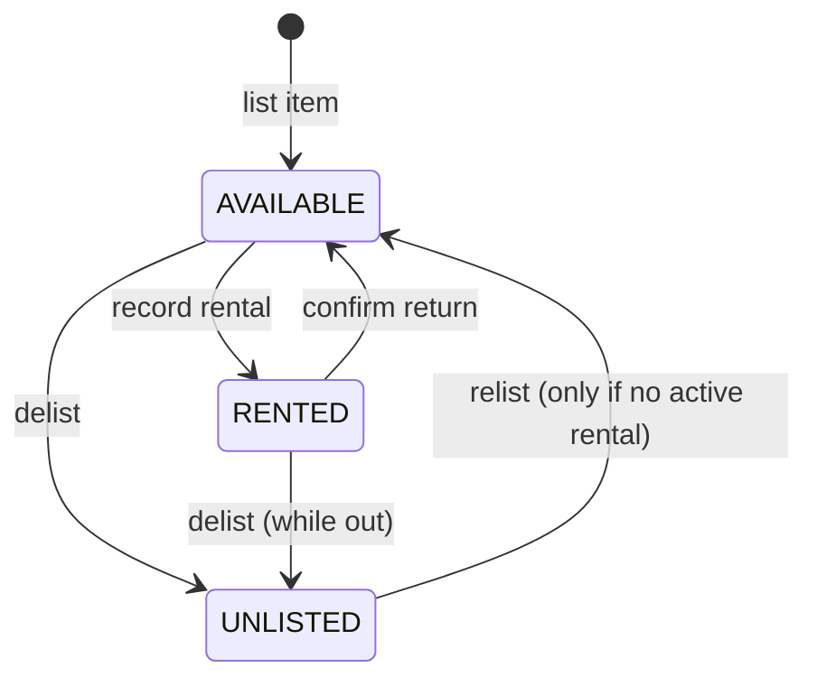

# Architecture

Single source of truth for the team. If code and this file disagree, fix one of them in the same PR.
Every rule below carries its **why**, so a rule can be challenged on its reasoning rather than ignored.

## 1. Layers and allowed dependencies

| Layer | Package | May depend on | Must NOT depend on |
|---|---|---|---|
| Transport | `transport` | service, domain, exception | repository, infrastructure, `java.sql` |
| Service | `service` | repository (interfaces), domain, exception | `repository.sqlite`, infrastructure, transport, `java.sql` |
| Repository API | `repository` | domain, exception | everything else |
| Repository impl | `repository.sqlite` | repository, infrastructure, domain, exception, `java.sql` | service, transport |
| Infrastructure | `infrastructure` | exception, `java.sql` | service, transport, repository |
| Domain | `domain` | exception (state machine only) | every other layer |
| Exception | `exception` | nothing | everything |
| Composition root | `Main` (root package) | everything | - |

**Why:** the spec's promise is that "nothing above the repository writes SQL or touches SQLite". A promise in a
document rots; `ArchitectureTest` (ArchUnit) turns it into a failing build, which is also the honest answer to the
review question "how is the layered architecture enforced?".

## 2. Package ownership

| Package / file | Owner | Reviewer(s) |
|---|---|---|
| `domain`, `exception`, `repository` (interfaces, `Transactor`), `service`, `Main`, `docs/architecture.md` | Francis (lead) | Fidel, Jackson |
| `infrastructure`, `repository.sqlite`, `schema.sql`, `data/`, `docs/database-design.md`, ER diagram | Fidel | Francis, Jackson |
| `transport`, test support (`SqliteTestSupport`), `docs` for CLI/demo | Jackson | Francis, Fidel |

Ownership means "primary author and final say on shape", not "only person allowed to touch it". Changes to a
contract file owned by someone else need that owner as reviewer.

## 3. Item state machine

Implemented in `ItemStatus` (`canTransitionTo` / `transitionTo`). The 3x3 matrix is pinned by `ItemStatusTest`.

Two rules the enum cannot express alone (they need the rentals table) and therefore live in the service:

1. **Relist guard.** `UNLISTED -> AVAILABLE` is legal for the state machine, but `ItemService.relist` first calls
   `rentals.findActiveByItemId`; if a rental is active it throws `BusinessRuleException` ("return it first").
2. **Return of a delisted-while-out item.** `RentalService.confirmReturn` always closes the rental; the item goes
   `RENTED -> AVAILABLE` only if it is still `RENTED`. If it is `UNLISTED` it stays `UNLISTED`.

**Why in code, not only in the database:** the spec requires "enforced in code, not just in the database". The DB
CHECK is the safety net (rejects garbage text); the enum gives a readable business error before we ever hit SQL.

## 4. Screen -> service contract (what the transport layer calls)

| Menu action (user-flow diagram) | Service call | Notes |
|---|---|---|
| First run? -> ask username | `UserService.findOwner()` empty -> `registerOwner(name)` | Owner = lowest-id user |
| List an item | `ItemService.listItem(ownerId, name, description, costPerDay)` | Created `available` |
| View my inventory | `ItemService.getInventory(ownerId)` | All statuses |
| Open an item | `ItemService.getDetails(itemId)` | Includes owner username |
| Delist | `ItemService.delist(itemId)` | From available or rented |
| Relist | `ItemService.relist(itemId)` | Blocked while out on rental |
| Record a rental: list | `ItemService.getAvailableItems(ownerId)` | Only `available` |
| Record a rental: confirm | `RentalService.recordRental(itemId, renterName, days)` | Finds or creates renter |
| Confirm a return: list | `RentalService.getActiveRentals(ownerId)` | By **rental** status, sorted by due date |
| Confirm a return: confirm | `RentalService.confirmReturn(rentalId)` | Item may stay unlisted |

Note on the flow diagram: it says "pick a *rented* item" for returns. Implement it as "pick an *active rental*".
An item delisted while out has status `unlisted` but its rental is still active, so filtering by item status would
make it impossible to return.

## 5. Decisions and their reasons

| # | Decision | Why |
|---|---|---|
| D1 | **Unchecked exceptions.** `DatabaseException extends RuntimeException`; `BusinessRuleException` is a separate unchecked tree. | Repositories catch checked `SQLException` once and rethrow typed exceptions, so no layer above declares `throws`. One catch in the menu loop can show the message and return to the menu. Business failures are not database failures, so they are not subclasses of each other. |
| D2 | **Four constraint subtypes** under abstract `ConstraintViolationException` (`Unique`, `ForeignKey`, `NotNull`, `Check`). | The spec requires each broken rule to throw its own exception and tests to assert that exact type. |
| D3 | **`findX` returns `Optional`; `getX` throws `NotFoundException`; an update touching 0 rows throws `NotFoundException`.** | "Absent" is normal for lookups such as first launch, but an error when the caller expected the row. Two names make the intent visible at the call site. |
| D4 | **`Transactor` interface in `repository`, implemented in `repository.sqlite`.** Services own transaction boundaries. | Recording a rental = insert rental + flip item status; both or neither. That is a business rule, so the service decides. The diagram keeps Service -> Repository only, so the service depends on an abstraction, not on `java.sql`. Nested calls join the outer transaction; a RuntimeException rolls back. |
| D5 | **Records with no validation** in domain constructors. | Tests must build an invalid `Item` (null name) to prove the *database* rejects it. Validation belongs to the service (`ValidationException`). |
| D6 | **`ItemStatus.fromDbValue` throws `IllegalArgumentException`**; the repository mapper wraps it in `MappingException`. | Keeps the domain free of persistence exceptions while still meeting "row won't map -> MappingException". |
| D7 | **Read models** `RentalDetails`, `ItemDetails`. | The return list needs item name + renter username per row: one joined query, not one query per row. |
| D8 | **`Clock` injected into `RentalService`**; `Main` passes `Clock.systemUTC()`. | "End time = start + days" must be testable with a fixed instant. |
| D9 | **Timestamps stored as UTC text `yyyy-MM-dd HH:mm:ss`**, `LocalDateTime` in the domain, formatted for display only in transport. | SQLite `CURRENT_TIMESTAMP` is UTC and text. Mixing local and UTC between `created_at` (database) and `start_time` (app) would silently corrupt comparisons and ordering. |
| D10 | **No static singletons; constructor injection wired only in `Main`.** `DatabaseManager` takes a `Path` and owns connection creation/configuration rather than a persistent application-wide connection. | Tests build the whole app on a temp file. Also makes the dependency direction visible in code. Normal repository operations use a connection for the duration of the operation; an active transaction owns one connection shared by participating repositories and closes it when the transaction commits or rolls back. |

| D11 | **Console I/O is injected** (`ConsoleInput` reads an `InputStream`, menus write to a `PrintStream`). | The spec demands 100% coverage; untestable `System.in/out` in the menus would make that impossible. ArchUnit forbids `System.in/out/err` outside `transport` (and `Main`). |
| D12 | **Pagination is in memory, in transport, one reusable list screen.** | Lists are small here; SQL stays simple; the three lists behave identically because they share one implementation. |
| D13 | **Owner = lowest-id user.** Empty users table = first launch. | The users table also stores renters, so "the account" has to be identified somehow; the owner is always the first row created (before any renter can exist). Revisit in project 2 (multi-user). |
| D14 | **Coverage gate is opt-in** (`mvn verify -Pcoverage-gate`). | Half-built features would otherwise block every PR. Turn it on before the demo; the report is produced on every `mvn test`. |

## 6. Rules for the database layer (Fidel)

- `PRAGMA foreign_keys = ON` on **every** connection. SQLite ignores foreign keys by default; without this the
  foreign-key test passes for the wrong reason (or the constraint is never enforced).
- CHECK on `listed_items.status` (`available`,`rented`,`unlisted`) and `rentals.status` (`active`,`closed`); values
  must equal `ItemStatus.dbValue()` / `RentalStatus.dbValue()`.
- Recommended safety nets: partial unique index `ON rentals(item_id) WHERE status = 'active'` (a double rental is
  impossible even if a service bug slips through); `CHECK (end_time > start_time)`; non-blank `item_name`;
  `cost_per_day` > 0.
- Translate `SQLiteException` by result code into the four constraint subtypes. Verify early (spike) that the driver
  reports the *extended* result codes; if not, fall back to matching the message text.
- Row mapping wraps `IllegalArgumentException` / `SQLException` from bad data in `MappingException`.
-`DatabaseManager` creates the parent directory and throws `DatabaseConnectionException` when the database cannot be opened. It does **not** hold a persistent application-wide connection and therefore does not implement `AutoCloseable`. Normal repository operations obtain and release their own connection. During a transaction, the transaction-owned connection is reused by participating repositories and is closed by the transaction boundary after commit or rollback.

- Testing the CHECK rule: `ItemStatus` is an enum, so the repository cannot be handed an out-of-range status. Test it
  by executing raw SQL through the same exception translator and asserting `CheckConstraintException`.

## 7. Testing conventions

- Real SQLite, temp file per test (JUnit `@TempDir`), never a mock.
- Each test builds its own data through the repository, runs one operation, then checks the database directly.
- Repository tests -> data layer and constraints. Service tests -> state transitions and business rules.
- Tests must pass in any order (no shared state).

## 8. Decisions made as a team (2026-09)

| # | Decision | Why | Enforced by |
|---|---|---|---|
| D15 | **No self-rental.** The renter must be a different account than the item's owner. | Otherwise an owner could "rent" their own item to inflate history or bypass the point of tracking who has what. | `RentalService.recordRental` compares `renter.id()` to `item.ownerId()` by identity (not by username text) and throws `BusinessRuleException`. A CHECK constraint (`renter_id != owner_id` via a join, or enforced at write time) should also guard this in `schema.sql` as a second line of defense — see Fidel's section below. |
| D16 | **`cost_per_day` is a decimal, not a whole number.** | The spec's sample data happens to use whole numbers, but real pricing needs cents (e.g. 2.50/day). | Domain: `Item.costPerDay` is `java.math.BigDecimal` (never `double` — binary floats cannot represent decimal fractions exactly, and repeated arithmetic would drift). Service: `Validation.requirePositive` rejects zero/negative. Database: SQLite has no decimal type, so Fidel stores it as TEXT and parses it back in the repository (see docs/database-design.md, to be filled in) — never as SQLite's REAL/float type, for the same reason. |
| D17 | **Minimum rental duration is 1 day.** No same-day/zero-day rentals. | Keeps the "end = start + days" model simple and matches how the item is billed (per day). | `Validation.requireAtLeastMinimumDays` in the service layer; also enforceable in `schema.sql` as `CHECK (end_time > start_time)` (already listed in section 6) as a second line of defense. |
